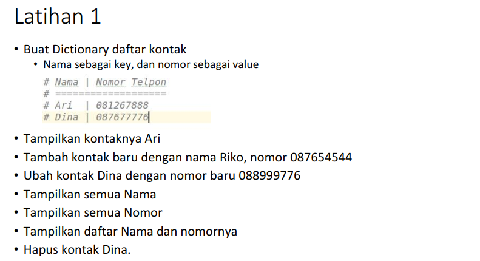
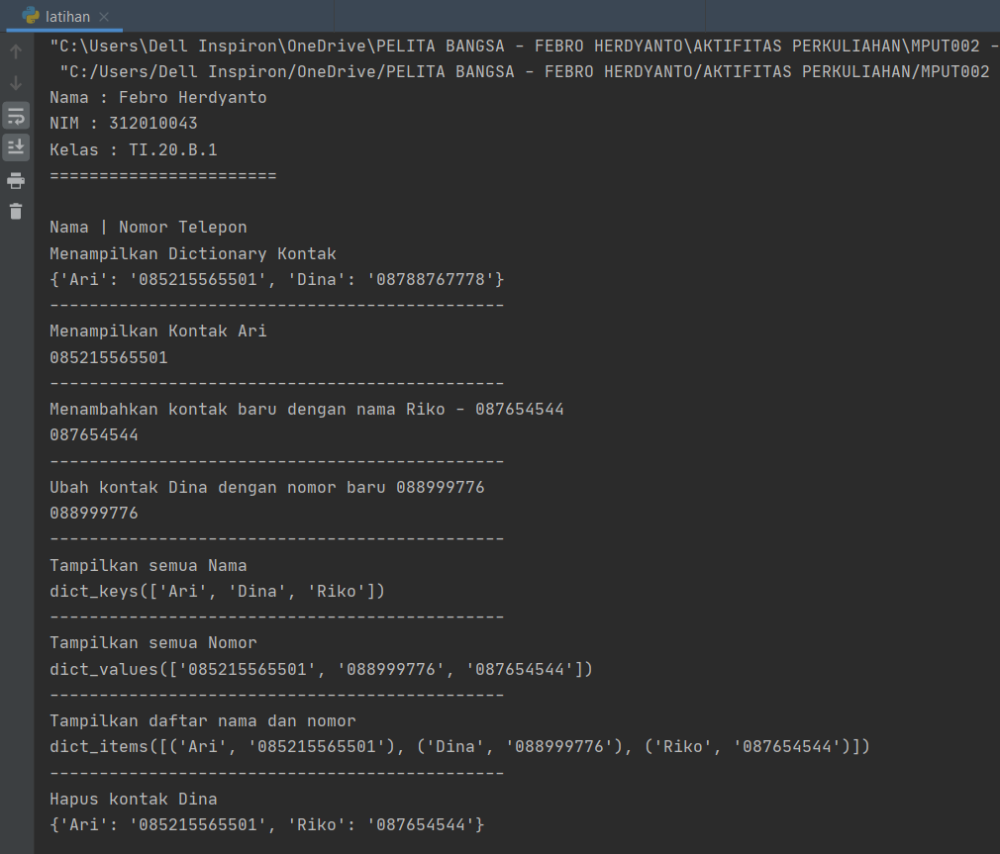
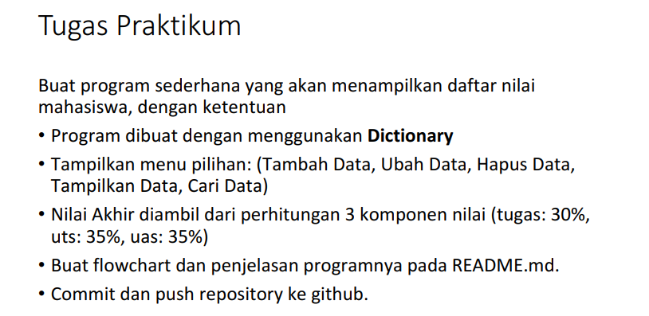
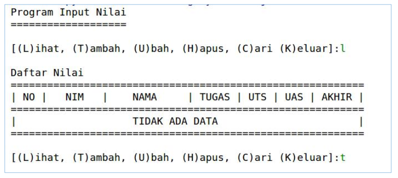
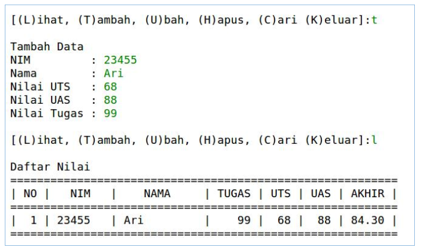
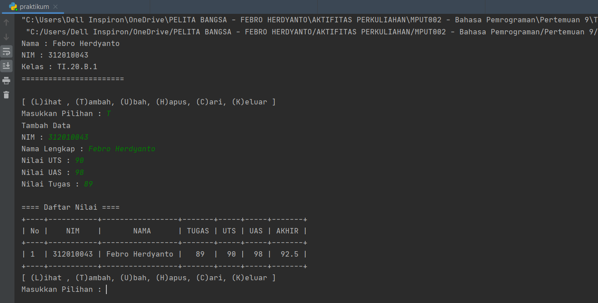
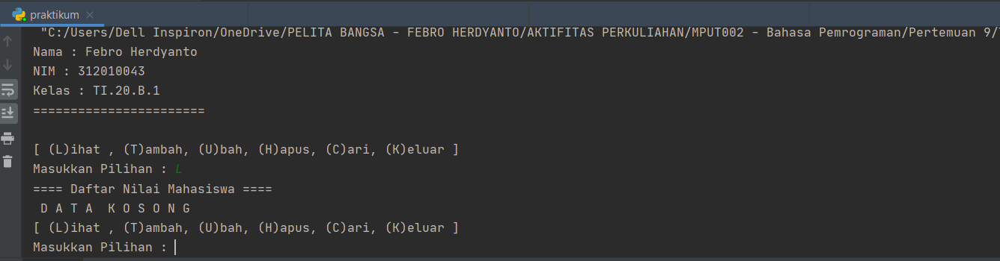
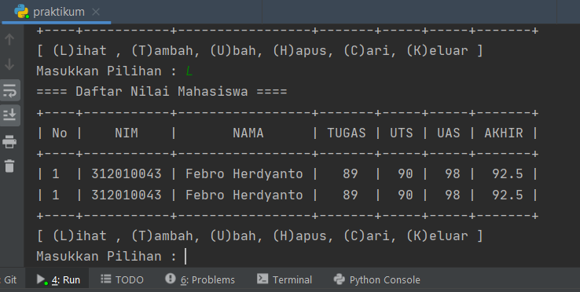

# Pertemuan 9 - Praktikum 5 *(repo: p9_praktikum5)*
Tugas Pertemuan 9 - Praktikum 5 (Bahasa Pemrograman)
<hr>

=========================<br>
= Nama  : Febro Herdyanto<br>
= NIM   : 312010043<br>
= Kelas : TI.20.B.1<br>
=========================<br>

Pada mata kuliah Bahasa Pemrograman - Pertemuan 9 kali ini saya mendapatkan materi *List, Tuple dan Dictionary*.<br>
Nah, untuk praktikum 5 ini materi yang didapatkan adalah **List**.<br>
<br>
* Didalam materi praktikum 5 ini terdapat 2 tugas. Yaitu : Latihan dan Praktikum.<br>

## Praktikum 5 - Latihan

* Berikut adalah tugas dari Latihan, bisa dilihat pada gambar dibawah ini :<br>
<br>
* Berikut jawaban / *source code* / program sederhana yang telah saya buat :<br>
``` python
print("Nama : Febro Herdyanto")
print("NIM : 312010043")
print("Kelas : TI.20.B.1")
print("=======================")
print()

kontak = {"Ari": "085215565501", "Dina": "08788767778"}
print("Nama | Nomor Telepon")
print("Menampilkan Dictionary Kontak")
print(kontak)
print("----------------------------------------------")
print("Menampilkan Kontak Ari")
print(kontak['Ari'])
print("----------------------------------------------")
print("Menambahkan kontak baru dengan nama Riko - 087654544")
kontak['Riko'] = '087654544'
print(kontak['Riko'])
print("----------------------------------------------")
print("Ubah kontak Dina dengan nomor baru 088999776")
kontak['Dina'] = '088999776'
print(kontak['Dina'])
print("----------------------------------------------")
print("Tampilkan semua Nama")
print(kontak.keys())
print("----------------------------------------------")
print("Tampilkan semua Nomor")
print(kontak.values())
print("----------------------------------------------")
print("Tampilkan daftar nama dan nomor")
print(kontak.items())
print("----------------------------------------------")
print("Hapus kontak Dina")
del kontak['Dina']
print(kontak)
```

* Untuk hasil dari source code tersebut adalah seperti berikut : <br>
<br>

## Praktikum 5 - Praktikum

Untuk tugas yang kedua yaitu Tugas Praktikum, yaitu tugas untuk membuat program sederhana menampilkan Data Nilai Mahasiswa.<br>
* Berikut soal yang diberikan oleh dosen :<br>
<br>

* Hasil yang diingkan oleh dosen, seperti ini :<br>
<br>

* Dan seperti ini :<br>
<br>

* Setelah saya membaca dan memahami materi, saya telah membuat program sederhana yang diminta dosen. Saya juga melihat dan membaca referensi dari Internet, entah itu berupa Forum ataupun lainnya. Berikut source code yang telah saya buat.<br>
``` python
from prettytable import PrettyTable

print("Nama : Febro Herdyanto")
print("NIM : 312010043")
print("Kelas : TI.20.B.1")
print("=======================")
print()

daftar = []
x = PrettyTable()

while True:
    print("[ (L)ihat , (T)ambah, (U)bah, (H)apus, (C)ari, (K)eluar ]")
    tanya = input("Masukkan Pilihan : ")
    if tanya == "L":
        print("==== Daftar Nilai Mahasiswa ====")
        no = 0
        no += 1
        x.field_names = ["No", "NIM", " NAMA", "TUGAS", "UTS", "UAS", "AKHIR"]
        if not daftar:
            x.field_names = ["No", "NIM", " NAMA", "TUGAS", "UTS", "UAS", "AKHIR"]
            print(" D A T A  K O S O N G")
        else:
            for data in daftar:
                x.add_row([no, data["nim"], data["nama"], data["tugas"], data["uts"], data["uas"], data["akhir"]])
            print(x)
    elif tanya == "T":
        print("Tambah Data ")
        nim_v = input("NIM : ")
        nama_v = input("Nama Lengkap : ")
        uts_v = input("Nilai UTS : ")
        uas_v = input("Nilai UAS : ")
        tugas_v = input("Nilai Tugas : ")
        akhir_v = 0.3 * float(tugas_v) + 0.35 * float(uts_v) + 0.35 * float(uas_v)
        daftar.append({"nim": nim_v, "nama": nama_v, "tugas": tugas_v, "uts": uts_v, "uas": uas_v, "akhir": akhir_v})
        print()
        print("==== Daftar Nilai ====")
        i = 0
        for data in daftar:
            i += 1
            x.field_names = ["No", "NIM", " NAMA", "TUGAS", "UTS", "UAS", "AKHIR"]
            x.add_row([i, data["nim"], data["nama"], data["tugas"], data["uts"], data["uas"], data["akhir"]])
        print(x)
    elif tanya == "U":
        print("EDIT FILE")
        print("Data siapa yang akan diubah ?")
        siapa = input("Masukkan NIM Mahasiswa yang akan diubah : ")

        print("Data apa yang akan diubah ? : ")
        mhs = input(" 1. Nama \n 2. Nilai Tugas \n 3. Nilai UTS \n 4. Nilai UAS\n Pilih dengan angka (1/2/3/4) : ")
        if mhs == "1":
            ubahnama = input("Silahkan masukan nama yang benar : ")
            i = 0
            d = next(item for item in daftar if item['nim'] == siapa)
            d['nama'] = ubahnama
            x.field_names = ["No", "NIM", " NAMA", "TUGAS", "UTS", "UAS", "AKHIR"]
            i += 1
            x.add_row([i, d["nim"], d["nama"], d["tugas"], d["uts"], d["uas"], d["akhir"]])
            print(x)
        elif mhs == "2":
            ubahtugas = input("Masukkan Nilai Tugas yang benar : ")
            i = 0
            d = next(item for item in daftar if item['nim'] == siapa)
            d['tugas'] = ubahtugas
            lihatuts = d['uts']
            lihatuas = d['uas']
            lihatakhir = 0.3 * float(ubahtugas) + 0.35 * float(lihatuts) + 0.35 * float(lihatuas)
            d['akhir'] = lihatakhir
            x.field_names = ["No", "NIM", " NAMA", "TUGAS", "UTS", "UAS", "AKHIR"]
            for data in daftar:
                i += 1
                x.add_row([i, data["nim"], data["nama"], data["tugas"], data["uts"], data["uas"], data["akhir"]])
            print(x)
        elif mhs == "3":
            ubahuts = input("Masukkan Nilai UTS yang benar : ")
            i = 0
            d = next(item for item in daftar if item['nim'] == siapa)
            d['uts'] = ubahuts
            lihattugas = d['tugas']
            lihatuas = d['uas']
            lihatakhir = 0.3 * float(lihattugas) + 0.35 * float(ubahuts) + 0.35 * float(lihatuas)
            d['akhir'] = lihatakhir
            x.field_names = ["No", "NIM", " NAMA", "TUGAS", "UTS", "UAS", "AKHIR"]
            for data in daftar:
                i += 1
                x.add_row([i, data["nim"], data["nama"], data["tugas"], data["uts"], data["uas"], data["akhir"]])
            print(x)
        elif mhs == "4":
            ubahuas = input("Masukkan Nilai UAS yang benar : ")
            i = 0
            d = next(item for item in daftar if item['nim'] == siapa)
            d['uas'] = ubahuas
            lihattugas = d['tugas']
            lihatuts = d['uts']
            lihatakhir = 0.3 * float(lihattugas) + 0.35 * float(lihatuts) + 0.35 * float(ubahuas)
            d['akhir'] = lihatakhir
            x.field_names = ["No", "NIM", " NAMA", "TUGAS", "UTS", "UAS", "AKHIR"]
            for data in daftar:
                i += 1
                x.add_row([i, data["nim"], data["nama"], data["tugas"], data["uts"], data["uas"], data["akhir"]])
            print(x)
        else:
            print("PILIHAN SALAH")

    elif tanya == "C":
        print(" ========== PENCARIAN DATA ==========")
        cari = input(" Pencarian berdasarkan NIM :")
        carinim = input("Masukkan NIM yang akan dicari : ")
        xdata = next(item for item in daftar if item['nim'] == carinim)
        print("NIM : ", carinim)
        print("Nama : ", xdata['nama'])
        print("Nilai Tugas : ", xdata['tugas'])
        print("Nilai UTS : ", xdata['uts'])
        print("Nilai UAS : ", xdata['uas'])
        print("Nilai Akhir : ", xdata['akhir'])
    elif tanya == "H":
        print("HAPUS DATA BERDASARKAN NIM")
        datahapus = input("Masukkan NIM data yang akan dihapus : ")
        xhapus = next(item for item in daftar if item['nim'] == datahapus)
        del xhapus['nim']
        del xhapus['nama']
        del xhapus['tugas']
        del xhapus['uts']
        del xhapus['uas']
        del xhapus['akhir']
        print("Data Berhasil Dihapus")

    elif tanya == "K":
        print("ANDA KELUAR DARI APLIKASI")
        break
    else:
        print("ANDA MEMILIH PILIHAN YANG SALAH")
```

* Cukup banyak baris yang saya buat untuk program tersebut. Dan saya akan menjelaskan sedikit pengertian dari fitur-fitur yang ada di program tersebut.<br>

* **Fitur Tambah Data.** <br>
Fitur ini akan muncul ketika mengetikan perintah **T** ,
Tampilannya seperti berikut ini :<br>
<br>
Pada fitur tersebut user akan diminta memasukkan data berupa : NIM, Nama, Nilai Tugas, Nilai UTS dan Nilai UAS<br>
Untuk nilai akhir akan muncul otomatis, karena telah diatur oleh system<br>
Data akan otomatis muncul dalam Table, saya menggunakan module *prettyTable* , module ini telah saya jelaskan pada praktikum 4<br>

* **Fitur Lihat Data**<br>
Fitur ini akan muncul ketika user mengetikkan perintah **L** <br>
Dalam fitur ini terdapat 2 output, system akan memunculkan seperti berikut, jika data Kosong atau tidak ada.<br>
<br>
Sedang kan output berikutnya akan menampilkan data dalam bentuk table<br>
<br>

* 
